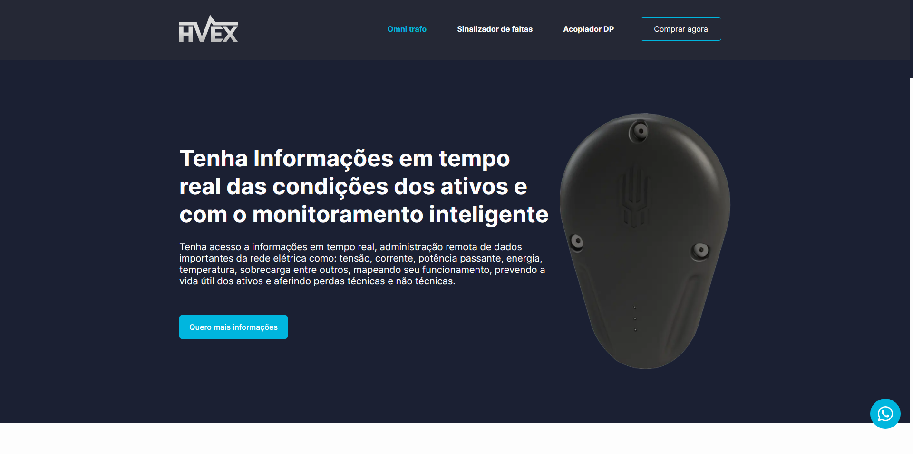
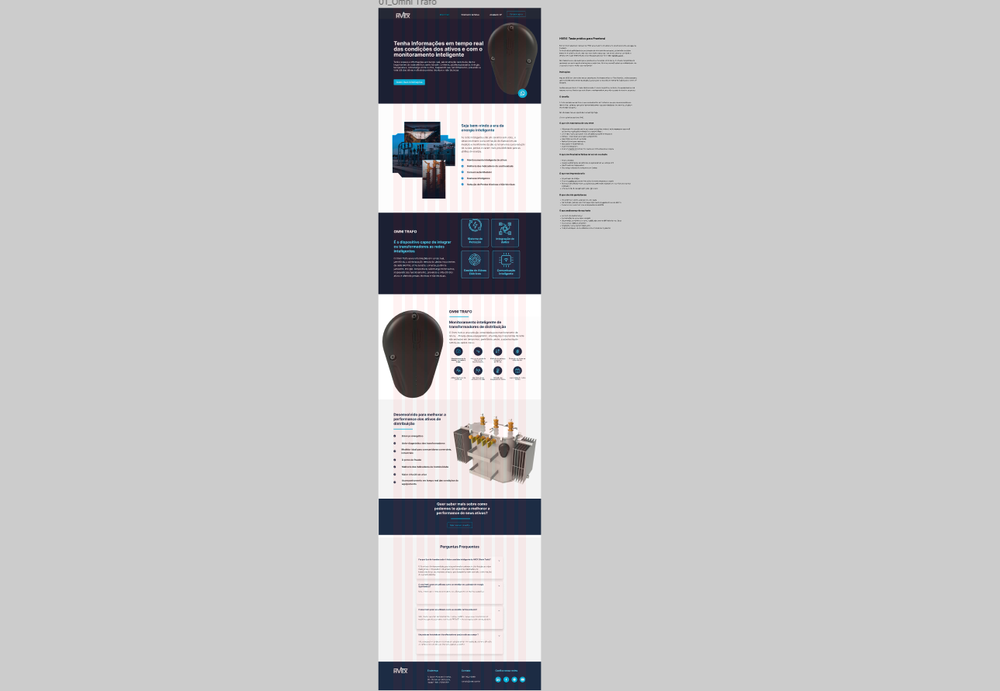
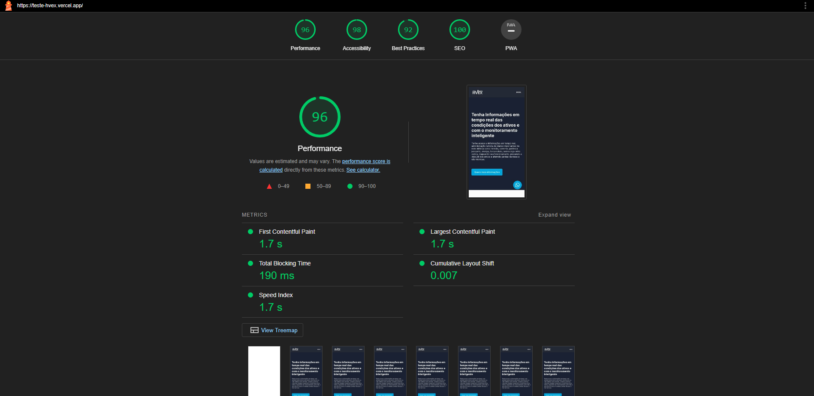

<h1 align="center">
    
    <br>
    Teste Técnico para Analista Desenvolvedor Front-end na HVEX
</h1>

<div align="center">
  
</div>

<p align="center"><a href="https://teste-hvex.vercel.app/">Acessar Projeto</a></p>

# Observação

Utilizei testes unitários para hooks e componentes que contém lógicas,
renderizações condicionais e listagens.

# Tecnologias

<p>Foram usadas as seguintes tecnologias:</p>

- [NextJS](https://nextjs.org/)
- [Typescript](https://www.typescriptlang.org/)
- [Styled-Components](https://styled-components.com/)
- [Jest](https://jestjs.io/pt-BR/)
- [Testing Library](https://testing-library.com/docs/)
- [Framer Motion](https://www.framer.com/motion/)

# Prototipagem

<div align="center">
  
</div>

# Lighthouse

O Lighthouse é uma ferramenta automatizada para melhorar o desempenho, a qualidade e
a exatidão de seus aplicativos da web. Mostrando média de pontuação em SEO, Acessibilidade,
Performance, Boas Práticas etc.

Nos testes que fiz, alternou entre 93 e 97.

<div align="center">
  
</div>

# Rodando o projeto

Você precisa ter o [Node](https://nodejs.org/en/), o [Git](https://git-scm.com/) e algum gerenciador de pacotes([NPM](https://docs.npmjs.com/downloading-and-installing-node-js-and-npm/) | [Yarn](https://classic.yarnpkg.com/lang/en/docs/install)) instalado em sua máquina.

```bash
1. Clone o repositório:
$ git clone https://github.com/gabriellima2/teste-hvex.git

2. Acesse a pasta e instale as dependências via terminal:
$ yarn || npm i

3. Inicie a aplicação em modo de desenvolvimento:
$ yarn dev || npm run dev

4. O servidor será aberto em http://localhost:3000
```

<p align="center">Projeto feito com 💙 por <a href="https://www.linkedin.com/in/gabriel-lima-860612236">Gabriel Lima</a></p>
